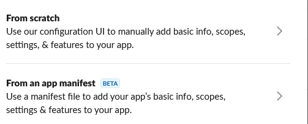

# App Manifest

This [manifest](https://api.slack.com/reference/manifests) is a configurations bundle for the Slacker bot on the [sndevs.com](https://sndevs.com/) workspace. With this manifest, you can use the Slack App UI or API to create your own version of Slacker with a pre-defined configuration that we know will work.

Please note that Slacker is the amalgamation of several different succesful and failed attempts to create different bot features. Thus, there is likely more scopes requisitioned than remotely necessary. This is just to get you to the finish line faster.

You would use this file when presented with this option:

- [YAML version](appmanifest.yaml)
- [JSON version](appmanifest.json)